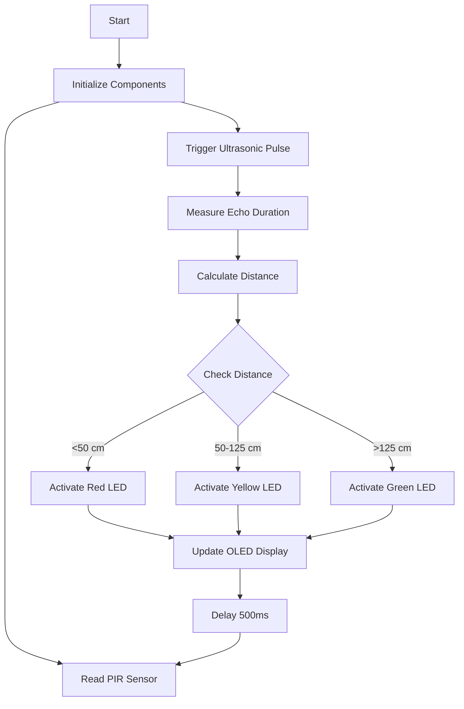

# Smart Distance & Motion Detection System 🚨

An Arduino-based embedded system that detects motion and measures object distance in real-time, providing visual feedback via LEDs and an OLED display. Ideal for IoT, security, or automation projects.

---

## 📌 Features
- **Real-Time Detection**: Combines HC-SR501 (PIR) and HC-SR04 (Ultrasonic) sensors.
- **Visual Feedback**: 
  - **LED Indicators**: Red (<50 cm), Yellow (50–125 cm), Green (>125 cm).
  - **OLED Display**: Shows motion status, distance, and proximity.
- **Stability**: Anti-flicker delay (500ms) for consistent readings.

---

## 🛠️ Components
| Category       | Components                                                                 |
|----------------|---------------------------------------------------------------------------|
| **Input**      | HC-SR501 (PIR Sensor), HC-SR04 (Ultrasonic Sensor)                        |
| **Output**     | SSD1306 OLED Display, Red/Yellow/Green LEDs (220Ω resistors)              |
| **Supporting** | Arduino Uno, Breadboard, Jumper Wires, Resistors                          |

---

## 🔌 Wiring Diagram
| Component         | Arduino Pin | Connection Type | Description                  |
|-------------------|-------------|------------------|------------------------------|
| **PIR Sensor**    |             |                  |                              |
| - VCC             | 5V          | Power            | Sensor VCC → 5V              |
| - OUT             | A0          | Digital Input    | Motion Detection Signal      |
| - GND             | GND         | Ground           | Sensor GND → GND             |
| **Ultrasonic**    |             |                  |                              |
| - TRIG            | A1          | Digital Output   | Trigger Ultrasonic Pulse     |
| - ECHO            | A2          | Digital Input    | Receive Echo Signal          |
| - GND             | GND         | Ground           | Sensor GND → GND             |
| **LEDs**          |             |                  |                              |
| - Red LED         | 13          | Digital Output   | Anode (+) → 220Ω → GND       |
| - Yellow LED      | 12          | Digital Output   | Anode (+) → 220Ω → GND       |
| - Green LED       | 11          | Digital Output   | Anode (+) → 220Ω → GND       |
| **OLED Display**  |             |                  |                              |
| - SDA             | A4          | I2C              | OLED SDA → A4                |
| - SCL             | A5          | I2C              | OLED SCL → A5                |

---

## ⚙️ Installation
1. **Prerequisites**:
   - Arduino IDE ([Download](https://www.arduino.cc/en/software))
   - Libraries: `Wire`, `Adafruit_GFX`, `Adafruit_SSD1306` (Install via Library Manager).

2. **Upload Code**:
   - Clone this repo:  
     `git clone https://github.com/yourusername/smart-distance-detection.git`
   - Open `SmartDistanceDetector.ino` in Arduino IDE.
   - Select board (Arduino Uno) and port.
   - Upload the code.

---

## 📝 Code Explanation
### Setup
- Initializes serial communication (`9600 baud`).
- Configures pin modes (Input/Output).
- Initializes OLED display.

### Loop
1. **Read Sensors**:
   - PIR sensor checks for motion (`HIGH`/`LOW`).
   - Ultrasonic sensor calculates distance via echo duration.
2. **Proximity Logic**:
   - Red LED: <50 cm
   - Yellow LED: 50–125 cm
   - Green LED: >125 cm
3. **Update OLED**: Displays real-time data.
4. **Delay**: 500ms for stability.

---

## 🔄 Workflow

---
## 🤝 Contributing
Feel free to fork, open issues, or submit PRs! Check the [Contributing Guide](https://contributing.md/) for details.

## 📜 License
This project is licensed under the MIT License. See LICENSE for details.

## Built with ❤️ by Ahmad Zulkarnaen
📧 Contact: [LinkedIn](https://www.linkedin.com/in/naen) | azulkarnaen@outlook.com

